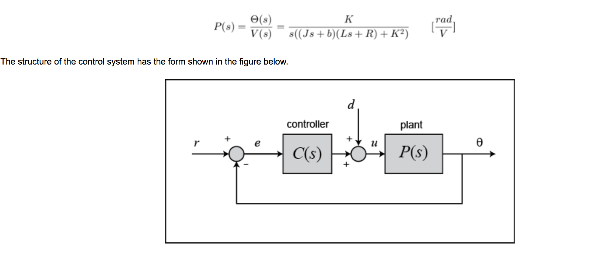
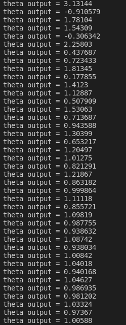

<h1 align="center"> DCMotor-PID-Controller </h1>

Reference to UMich Control Tutorials for MATLAB & SIMULINK

## Open-loop transfer function of DC Motor ##

## Inputs ##
* Kp (proportional gain) = 21
* Ki (integral gain) = 500 
* Kd (derivative gain) = 0.15

## Executables ##
* Clone the repository
* Compile it (eg. `g++ main.cpp pid.cpp -o {executable name}`)
* Run (eg. `./{executable name}`)

## Sample Output ##

